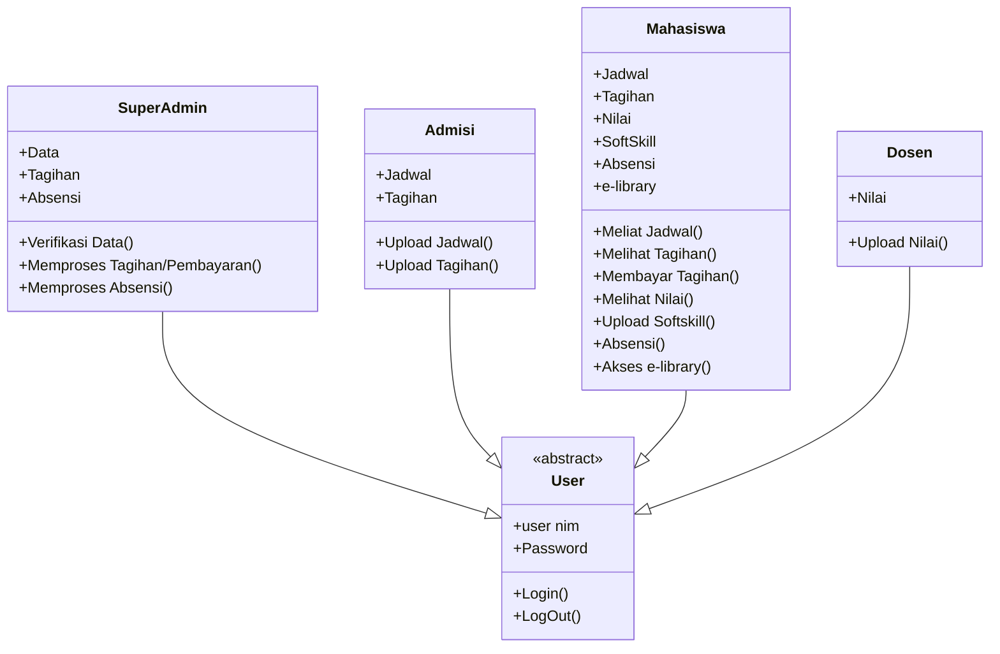

# PORTAL UKRIDA
# FURPS
## Functionality (F):
-	Sistem harus memberikan fungsionalitas lengkap yang memungkinkan pengguna untuk mengakses semua informasi yang mereka butuhkan terkait dengan kegiatan akademik, administrasi, dan kegiatan kampus lainnya.  
-	Fitur-fitur utama seperti profil pengguna, pembelajaran online, e-library,  sistem tagihan, upload soft skill, dan sistem absensi harus diperhitungkan.  
-	Sistem harus menyediakan fitur pencarian yang efisien untuk memudahkan pengguna menemukan informasi yang relevan.  
## Usability (U):
-	Antarmuka pengguna harus ramah pengguna dan mudah dinavigasi.  
-	Desain harus konsisten di seluruh portal untuk mengurangi kebingungan pengguna.  
-	Pengguna harus dapat mengakses informasi dengan beberapa klik, tanpa perlu menghadapi hambatan yang berarti.  
-	Teks dan ikon harus mudah dipahami dan mengarahkan pengguna dengan jelas pada tindakan yang diinginkan.
## Reliability (R):
-	Sistem harus stabil dan dapat diandalkan, dengan waktu penyediaan yang minimal.  
-	Sistem harus dapat menangani jumlah pengguna yang besar tanpa mengalami penurunan kinerja yang signifikan.  
-	Data pengguna dan informasi akademik harus diamankan dengan baik untuk mencegah akses yang tidak sah.
## Performance (P):
-	Waktu tanggapan sistem harus cepat, dengan waktu pemuatan halaman yang minimal.  
-	Fitur-fitur seperti pembelajaran online dan sistem absensi harus berfungsi dengan lancar tanpa jeda atau penundaan yang signifikan.  
-	Sistem harus dapat menangani lalu lintas tinggi pada saat-saat sibuk, seperti pendaftaran kelas atau pengumuman hasil ujian.
## Supportability (S):
-	Sistem harus mudah untuk dipelihara dan diperbarui oleh administrator.  
-	Diperlukan dokumentasi yang lengkap dan jelas untuk penggunaan sistem, termasuk panduan pengguna dan instruksi pemecahan masalah.  
-	Dukungan teknis harus tersedia untuk membantu pengguna dengan masalah yang mungkin mereka alami saat menggunakan sistem.
# Use Case and User Stories
### User Roles (Actor)
-	Mahasiswa
-	Dosen
-	Super Admin
-	Admisi
### User Stories (Functionalities)
#### Mahasiswa
-	Login
-	Melihat Jadwal
-	Melihat Nilai
-	Membayar Tagihan
-	Upload Softskill
-	Absensi
-	Akses E-Library
#### Dosen
-	Login
-	Input Nilai
#### Super Admin
-	Login
-	Memproses Pembayaran
-	Memproses Absensi
#### Admisi
- Login
-	Input Tagihan

# USE CASE 

# CLASS DIAGRAM

